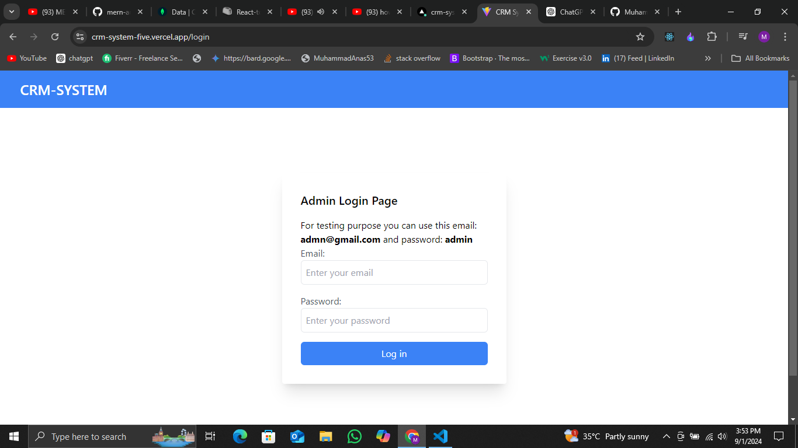

# CRM System

## Overview
A simple CRM system built with MERN stack with authentication using JWT and cookie. that allows Admin to manage customer details.

## Features
- Backend API with Express & MongoDB
- Routes for admin auth, customer create, delete and edit and get on customer based on id.
- JWT authentication stored in HTTP-only cookie
- Protected routes and endpoints
- Custom middleware to check JSON web token and store in cookie
- Custom error middleware
- React frontend to register, login, logout, view profile, and update profile
- React Toastify notifications

## Screenshots

Here is a screenshot of the customer list:



### Prerequisites
- Node.js >= v14
- npm >= v6

### Installation
```bash
if your need to install only 
git clone https://github.com/Muhammad-Anas-3/CRM-system.git
cd crm-system
npm install
npm start
